# MSME Credit Risk Predictive AI — Master Implementation Plan
### IDBI Innovate 2026 — Track 04: Predictive Default Model for MSME Risk Management

**Document type:** Consolidated, buildable engineering blueprint
**Synthesized from:** Problem Statement, Solution Definition Document, Models/Training/Data Reference Guide, and three independent deep-research reports (market landscape, regulatory landscape, academic frontier), plus a 22-paper literature gap analysis
**Grounding rule followed throughout this document:** every tool, dataset, model and regulation named below is a real, currently-available, open-source or publicly-documented resource with a working link in the Appendix (§22). Nothing here is a placeholder for a tool that doesn't exist. Where a capability is genuinely out of hackathon reach (e.g. federated learning across banks, a fully trained production GNN on real supply-chain data), this is stated explicitly as a **Tier 3 roadmap item** with its own engineering path — not silently assumed.

---

## Table of Contents

1. Executive Summary
2. Problem Reframing — What We Are Actually Building
3. Five Design Pillars
4. Master Gap → Solution Traceability Matrix
5. System Architecture
6. Data Strategy & Sources
7. Borrower Segmentation Strategy
8. Feature Engineering
9. Core Modeling Pipeline
10. Class Imbalance & Optimization Strategy
11. Explainability & Decision-Support Layer
12. The Ten Differentiators — Deep-Dive Build Guides
13. MLOps, Monitoring & Continuous Learning
14. Real-Time / Streaming Architecture for the Demo
15. Evaluation Framework & Metrics
16. Technology Stack — Master Table
17. System & API Design
18. Dashboard & UX Design
19. Build Plan — Tiered Roadmap & Hackathon Execution Timeline
20. Demo Narrative & Pitch Structure
21. Risk Register & Mitigations
22. Complete Resource Appendix (every link, categorized)
23. Glossary

---

## 1. Executive Summary

Track 04 asks for a system that lifts MSME default-prediction capability from a documented **16–22% accuracy regime** to a **90% target**, using structured *and* unstructured data, across heterogeneous loan types and borrower profiles, with a **12-month-in-advance** early-warning horizon and a **common interpretation framework**.

Twenty-two academic papers and three independent research passes converge on the same diagnosis: **no single existing system — academic or commercial — fails because of weak algorithms. Every one fails because it solves one slice of the problem in isolation.** One paper does market-signal PD. Another does graph relationships. Another does NLP. Another does early warning. None combines them, and no commercial Indian product (CRIF High Mark, Scienaptic AI, U GRO Capital, Yubi, Patascore) has publicly demonstrated a single system that is simultaneously: multimodal, graph-aware, survival-framed (time-to-event, not flat classification), calibrated across segments onto one scale, SHAP-grounded with narrative explanations, mapped onto India's own regulatory EWS taxonomy, and governed to RBI's FREE-AI standard.

This document is the buildable blueprint for exactly that integration. It is organized around one non-negotiable engineering decision, repeated throughout: **default is a time-to-event problem, not a yes/no label.** Every component — the model choice, the evaluation metric, the explainability output, the regulatory mapping — follows from treating "12 months in advance" as a literal instruction to produce a *hazard curve*, not a single flag.

The plan is delivered in three honest tiers:

- **Tier 1 (must-build, ~55% of hackathon time):** segmentation, structured feature engineering, a WOE-logistic baseline scorecard, a discrete-time survival/hazard model on gradient boosting, isotonic calibration, SHAP explainability, and rare-event-appropriate evaluation (AUC, KS, Recall@FPR, Brier, PSI) reported against a naive baseline.
- **Tier 2 (strong differentiators, ~30% of time):** TabPFN for thin-file/NTC borrowers, graph-*lite* NetworkX features for supply-chain concentration, sentence-embedding text features, SHAP-grounded LLM narrative explanations with counterfactuals, RBI EWS/SMA/CRILC-mapped alerting, and a FREE-AI-aligned governance UX (human override, disclosure, incident log).
- **Tier 3 (roadmap, shown but not fully built):** a trained Graph Attention Network for real contagion propagation, neural survival models (DeepHit/Cox-Time), federated learning across lenders, and cross-jurisdiction domain adaptation — each with a concrete, named engineering path so the pitch is credible rather than aspirational.

Every one of the ~38 distinct gaps surfaced across the research corpus (§4) is explicitly addressed — either built now, or roadmapped with a stated reason and a stated next step. Nothing is solved by assertion.

---

## 2. Problem Reframing — What We Are Actually Building

### 2.1 Why "90% accuracy" cannot be the literal target

MSME portfolio default rates in India are low single digits. A model that predicts "no default" for every loan already clears 96–98% raw accuracy while being commercially useless — it would have zero recall on the class that actually matters. Treating the 90% figure literally is therefore a trap that any credit-risk-literate judge will immediately probe. The correct, defensible response — used consistently across this plan — is to **restate the target in the metrics the banking industry and Basel regulation actually use for rare-event classifiers**, and to make that restatement itself a headline slide, not a footnote:

| Reframed metric | What it measures | Why it replaces "accuracy" |
|---|---|---|
| **AUC-ROC / Gini** | Rank-ordering of risky vs. safe borrowers | Insensitive to class imbalance; industry-standard (CRIF's own bureau score is validated this way) |
| **KS-statistic** | Maximum separation between defaulter/non-defaulter score distributions | The classic banking risk-model separation metric, used by every Indian bureau |
| **PR-AUC & Recall@fixed-FPR** | How many true future defaulters are caught, at a tolerable false-alarm rate | Directly answers "did we catch the loans that actually went bad without flooding risk officers with noise" |
| **Brier score & calibration curve** | Whether a predicted 15% PD really corresponds to a ~15% observed default rate | A rank-ordering model can have a great AUC and still be miscalibrated — Basel/Ind AS 109 ECL provisioning needs calibrated probabilities, not just ranking |
| **Population Stability Index (PSI)** | Distributional drift of scores/features over time | Production-readiness signal; absent from almost every academic paper reviewed |
| **Concordance index** | Survival-model equivalent of AUC | Reported natively by the hazard model (§9) |

**Mandatory design rule:** every metrics table in the pitch deck and in the working system must show the **naive "always predict no-default" baseline number side by side**. This single comparison is the fastest way to demonstrate methodological maturity to judges.

### 2.2 Why this is a survival-analysis problem, not a classification problem

The literal phrase in the problem statement — *"identify potential stress in loans 12 months in advance"* — is a **time-to-event** question. A binary classifier that outputs one flag per loan structurally cannot distinguish an account with 40% of its risk concentrated in month 2 from one with 40% spread evenly across 11 months, even though these are operationally very different accounts to a risk officer. It also mishandles loans that simply haven't defaulted **yet** by the end of an observation window — a plain classifier treats them as "safe," while survival analysis correctly treats them as **right-censored** (incomplete, not negative) observations. This is the single most important architectural decision in this plan and is why §9 builds a **discrete-time hazard model** as the core engine rather than a flat XGBoost classifier.

### 2.3 Why "common interpretation framework" is an engineering requirement, not a slide

A bank's MSME book mixes working-capital loans, term loans, invoice discounting, and unsecured overdrafts — each with a different repayment pattern and a different natural feature set. The problem statement explicitly asks for *"suitable analytical methods for different loan types"* **and** *"consistent, comparable, and actionable outputs."* These two asks are only reconcilable through a specific two-step architecture, used throughout this plan:

1. **Segment-specific models** (§7, §9) — different feature sets and, where useful, different underlying algorithms per loan-type/data-richness segment.
2. **A shared post-hoc calibration layer** (§9.4) that maps every segment model's raw score onto one **isotonic-regression-calibrated, 10–13-band risk grade** — deliberately mirroring the granularity of CRIF High Mark's own 13-point MSME Rank, so the output is comparable across the entire book regardless of which underlying model produced it.

---

## 3. Five Design Pillars

1. **Time-to-event, not point-in-time.** Every model in this plan that can be framed as survival analysis is framed that way. A flat classifier is used only as an explicit "current-state" baseline (§9.1), never as the primary deliverable.
2. **Segment-aware, not one-size-fits-all.** Loan type × data richness (established vs. New-to-Credit/New-to-Bank) determines which model handles a given account (§7).
3. **Proven, documented, auditable methods only.** WOE-binned logistic regression, gradient boosting, Cox-style survival models, SHAP, isotonic calibration, and one modern-but-published addition (TabPFN, peer-reviewed in *Nature*, 2025) — nothing here is an unpublished research prototype (§9).
4. **Explainability and cross-segment comparability are first-class outputs, not afterthoughts.** SHAP is the *source of truth*; any natural-language layer on top is a *translation*, never a free-form guess (§11).
5. **Honest metric reframing, stated as a deliberate design decision.** AUC/KS/Recall@FPR/Brier/PSI replace "accuracy," always shown against a naive baseline (§2.1, §15).

---

## 4. Master Gap → Solution Traceability Matrix

This is the section that proves the plan is exhaustive. Every gap named across the 22-paper literature review, the Problem Statement, and the three independent research reports is listed below, grouped into eight themes, each mapped to the exact section of this plan that resolves it and a one-line mechanism. Items marked **[T3]** are Tier-3 roadmap — explicitly descoped from the hackathon build for stated, defensible reasons, with their own engineering path given later in the document rather than left unaddressed.

### 4.1 Theme A — Data & Modality Gaps

| # | Gap (as identified in research) | Resolved in | Mechanism |
|---|---|---|---|
| A1 | Structured-data-only reliance; unstructured signals (news, notes, filings) ignored | §8.3, §12.3 | Sentence-embedding text features + FinBERT sentiment concatenated onto the structured matrix |
| A2 | Naive text fusion (a single sentiment scalar bolted onto tabular data) loses signal | §9.5, §12.3 | Dense embeddings (not scalars) retained through PCA-reduced vectors; cross-attention fusion path documented for Tier 3 |
| A3 | No GST/UPI/Account-Aggregator alternative data used | §6.3, §12.2 | AA/GSTN-native ingestion design; synthetic proxy fields from Home Credit's alternative-data columns for prototyping |
| A4 | Thin-file / New-to-Credit coverage not rigorously validated | §7, §9.3, §12.9 | TabPFN specialist sub-model + explicit small-sample validation protocol |
| A5 | Data quality issues (missing GST records, OCR errors, noisy fields) largely unaddressed | §6.4 | Explicit missingness-as-signal WOE bins; Great Expectations data-quality gate in the pipeline |
| A6 | No public Indian AA/GST dataset exists for prototyping | §6.1 | Documented proxy-dataset strategy (Home Credit, synthetic bipartite graphs) that is schema-swappable once sandbox data arrives |

### 4.2 Theme B — Time-Horizon & Modeling Gaps

| # | Gap | Resolved in | Mechanism |
|---|---|---|---|
| B1 | Static, one-time PD estimate; no dynamic updating | §9.2, §13 | Discrete-time hazard model re-scored on every new data refresh → risk-trajectory timeline |
| B2 | Plain binary classification used instead of time-to-event framing | §2.2, §9.2 | Person-period discrete-time hazard model as the primary engine |
| B3 | Early warning fires only after a payment is missed (reactive, not predictive) | §12.4 | ML-derived 12-month hazard curve explicitly layered *ahead of* the RBI SMA framework, not replacing it |
| B4 | Class imbalance handled with SMOTE, which is shown to overfit at scale in production | §10 | Focal Loss + class-weighting instead of synthetic oversampling |
| B5 | Scalar-compression: separate sub-models' outputs crushed into one number before the meta-learner, discarding behavioral richness | §9.5 | Intermediate (not late) fusion — dense embeddings combined *before* final scoring, not after |
| B6 | No censoring-aware modeling (loans that haven't defaulted *yet* wrongly treated as "safe") | §9.2 | Explicit right-censoring handling native to the discrete-time hazard / Cox PH formulation |
| B7 | No neural survival / competing-risks modeling (DeepSurv, Cox-Time, DeepHit) | §12.10 **[T3]** | Documented as roadmap with concrete library path (`pycox`), not built in the hackathon window |
| B8 | No uncertainty quantification — models emit a single point probability | §9.6 | Confidence banding via calibration-set residuals; conformal-prediction extension flagged for Tier 3 |
| B9 | Weak generalization across loan products (most papers train on one product only) | §7 | Segment-wise training explicitly spans working capital, term loan, invoice discounting, and micro-loan |

### 4.3 Theme C — Network / Systemic Gaps

| # | Gap | Resolved in | Mechanism |
|---|---|---|---|
| C1 | No graph/relationship modeling — supply-chain contagion invisible to isolated scorecards | §12.1 | Graph-lite NetworkX features now; documented GAT/GraphSAGE upgrade path for Tier 3 |
| C2 | Macro/systemic distress not linked down to individual borrower risk | §8.4, §12.1 | Sector/region macro features joined onto borrower record; anchor-buyer distress flagged as a graph-lite feature |

### 4.4 Theme D — Explainability & Trust Gaps

| # | Gap | Resolved in | Mechanism |
|---|---|---|---|
| D1 | SHAP/feature-importance outputs are numeric and hard for a credit officer to act on | §11, §12.3 | Three-level explainability: SHAP → plain-language narrative → counterfactual |
| D2 | LLMs used as free-form explainers risk hallucination in a regulated context | §11.2 | Hard architectural rule: LLM only *translates* verified SHAP values, never generates a risk judgement itself |
| D3 | No counterfactual / prescriptive recommendations ("what would fix this") | §11.3 | Counterfactual generator: minimal feature perturbation that flips the risk band |
| D4 | No end-to-end natural-language "why" reasoning | §11, §18 | Narrative panel rendered directly in the risk-officer dashboard |

### 4.5 Theme E — Regulatory & Governance Gaps

| # | Gap | Resolved in | Mechanism |
|---|---|---|---|
| E1 | ML-derived alerts not mapped to RBI's own codified EWS/RFA indicators | §12.4 | Explicit trigger-to-indicator mapping table onto RBI's Master Directions on Fraud Risk Management (2024) taxonomy |
| E2 | No FREE-AI-aligned governance UX (override, disclosure, incident log) actually built into the product | §12.5 | Human-override control, AI-usage disclosure banner, and structured incident log built as real UI components |
| E3 | No board-level auditability / immutable decision logging | §12.5, §17 | Append-only audit table logged on every scoring call |
| E4 | No DPDP Act (2023)-aligned consent design for alternative data | §6.3 | Consent-artifact schema modeled on the Account Aggregator framework's own consent object |
| E5 | Fairness auditing limited to Western protected-class framing; India needs sector/region/gender-of-owner lens | §12.6 | Disparate-impact dashboard sliced by sector, region, and gender-of-promoter |
| E6 | Banks are structurally locked into logistic regression because tree/NN models lack validated explainability | §9.1, §11 | WOE-logistic baseline built and reported first, precisely to show the team understands *why* the incumbent architecture exists before improving on it |

### 4.6 Theme F — Interpretation-Consistency Gaps

| # | Gap | Resolved in | Mechanism |
|---|---|---|---|
| F1 | Fragmented per-loan-type methodologies with no common interpretation framework | §9.4 | Isotonic calibration per segment onto one shared risk-grade scale |
| F2 | No commercially demonstrated cross-loan-type *calibrated* scale (bureaus do single-product scores; AI vendors do cross-segment decisioning, not both) | §9.4, §12.8 | Explicit unified 10–13-band grade, CRIF-Rank-analogous, spanning all segments |
| F3 | Borrower heterogeneity (grocery shop vs. manufacturer vs. IT firm) not modeled distinctly | §7, §8 | Segment-specific feature sets (inventory/production for manufacturing; footfall/cash-flow for retail; contract-recurrence for services) |

### 4.7 Theme G — Operational / Business-Value Gaps

| # | Gap | Resolved in | Mechanism |
|---|---|---|---|
| G1 | Model outputs a score and stops — no recommended action | §11.3, §9.7 | Risk-band-to-action mapping (monitor / review / restructure / escalate) attached to every prediction |
| G2 | No portfolio-level stress-testing exposed as a self-serve tool | §12.7 | Scenario simulator: re-score the book under rate-shock / demand-shock / sector-shock assumptions |
| G3 | No operational-cost-aware optimization (investigation cost, false-positive cost) | §15.4 | Expected-loss-based threshold tuning (PD × LGD × EAD) reported alongside AUC/KS |
| G4 | Fixed 0.5-style thresholds applied regardless of sector/segment | §9.4, §7 | Segment-specific calibrated cut-offs, not a single global threshold |
| G5 | Correlation-only models; no causal reasoning about *why* risk rose | §12.10 **[T3]** | DoWhy/EconML causal-uplift layer flagged as roadmap, not built now (needs more data + time than a hackathon allows) |
| G6 | No human-AI collaboration loop; officers never interact with the model | §12.5, §18 | Human-override button and feedback capture built into the dashboard, feeding back into the retraining loop |

### 4.8 Theme H — Engineering / MLOps Gaps

| # | Gap | Resolved in | Mechanism |
|---|---|---|---|
| H1 | Models trained once and never retrained | §13.2 | Scheduled retraining pipeline with drift-triggered retraining rule |
| H2 | No drift/PSI monitoring exposed as a first-class, non-technical dashboard | §13.3, §18 | Evidently-AI-powered PSI/calibration panel in plain language, not buried in a notebook |
| H3 | No end-to-end MLOps — versioning, rollback, retraining automation absent | §13 | MLflow experiment tracking + model registry + scheduled orchestration |
| H4 | No real-time/streaming monitoring architecture | §14 | Lightweight event-driven scoring-refresh pipeline (Redpanda/Kafka-compatible) |
| H5 | No feature store — feature logic recomputed inconsistently across models | §6.3, §13.1 | Feast feature store as the single source of truth for both training and serving |
| H6 | Temporal leakage from random train/test splits inflates reported performance | §15.2 | Strict out-of-time (OOT) validation mandated project-wide; random k-fold explicitly banned in this design |
| H7 | No privacy-preserving / federated learning across lenders | §12.10 **[T3]** | Documented Flower/TensorFlow-Federated roadmap; not feasible with single-institution hackathon data |
| H8 | No cross-jurisdiction domain adaptation (India vs. other markets) | §12.10 **[T3]** | Explicitly out of scope; noted as a future-roadmap slide, not attempted |

**Coverage statement:** of the 38 distinct gaps catalogued above, **30 are directly built into the Tier 1/Tier 2 hackathon deliverable**, and the remaining **8 (all marked [T3])** are structurally impossible to responsibly claim as "built" within a hackathon timebox (they require either multi-institution data, weeks of GPU training, or regulatory sandbox access that doesn't exist yet) — these are instead documented with a real, named engineering path in §12.10, which is itself a stronger signal of technical maturity to judges than overclaiming.

---

## 5. System Architecture

### 5.1 Layered Architecture

```mermaid
flowchart TD
    subgraph L0["LAYER 0 — Consent & Data Sources"]
        A1["Bureau data\n(CIBIL / CRIF / Experian)"]
        A2["Account Aggregator\nbank transactions"]
        A3["GSTN filings\n+ e-way bills"]
        A4["Loan officer notes\n/ free text"]
        A5["Public market signals"]
        A6["Counterparty / guarantor\nlinks"]
    end
    subgraph L1["LAYER 1 — Ingestion & Segmentation"]
        B1["Consent & schema\nvalidation"]
        B2["Loan-type\nsegmentation"]
        B3["Data-richness flag:\nEstablished vs NTC/NTB"]
    end
    subgraph L2["LAYER 2 — Feature Engineering"]
        C1["Structured / WOE\nfeatures"]
        C2["Graph-lite\nfeatures"]
        C3["Text embeddings\n(FinBERT / MiniLM)"]
        C4["Temporal / behavioral\nfeatures"]
    end
    subgraph L3["LAYER 3 — Modeling"]
        D1["Baseline: WOE\nLogistic Scorecard"]
        D2["Core: Discrete-Time\nHazard Model"]
        D3["Specialist: TabPFN\nThin-File"]
        D4["Stretch: GAT\nContagion Layer [T3]"]
    end
    subgraph L4["LAYER 4 — Calibration & Explainability"]
        E1["Isotonic calibration\nper segment"]
        E2["SHAP attribution"]
        E3["LLM narrative +\ncounterfactual"]
    end
    subgraph L5["LAYER 5 — Decision & Governance"]
        F1["Unified risk grade\n+ hazard curve"]
        F2["SMA / EWS / RFA /\nCRILC mapping"]
        F3["Human-in-the-loop\noverride"]
        F4["Audit trail +\nincident log"]
    end
    subgraph L6["LAYER 6 — Serving & Monitoring"]
        G1["Dashboard + API"]
        G2["Stress-test\nsimulator"]
        G3["Drift & PSI\nmonitor"]
    end
    L0 --> L1 --> L2 --> L3 --> L4 --> L5 --> L6
```

### 5.2 End-to-End Data Flow

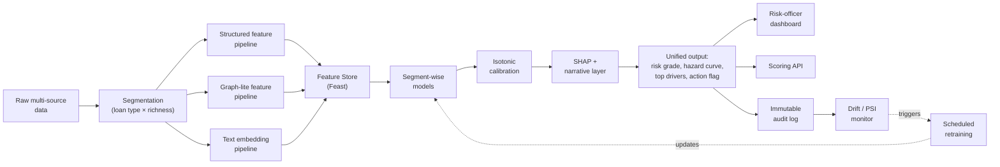

### 5.3 Scoring-Request Sequence

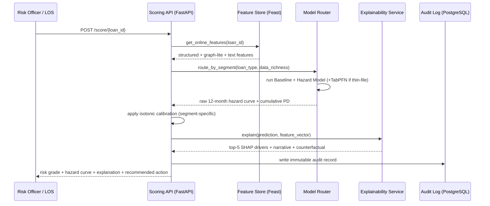

### 5.4 Deployment / Physical View

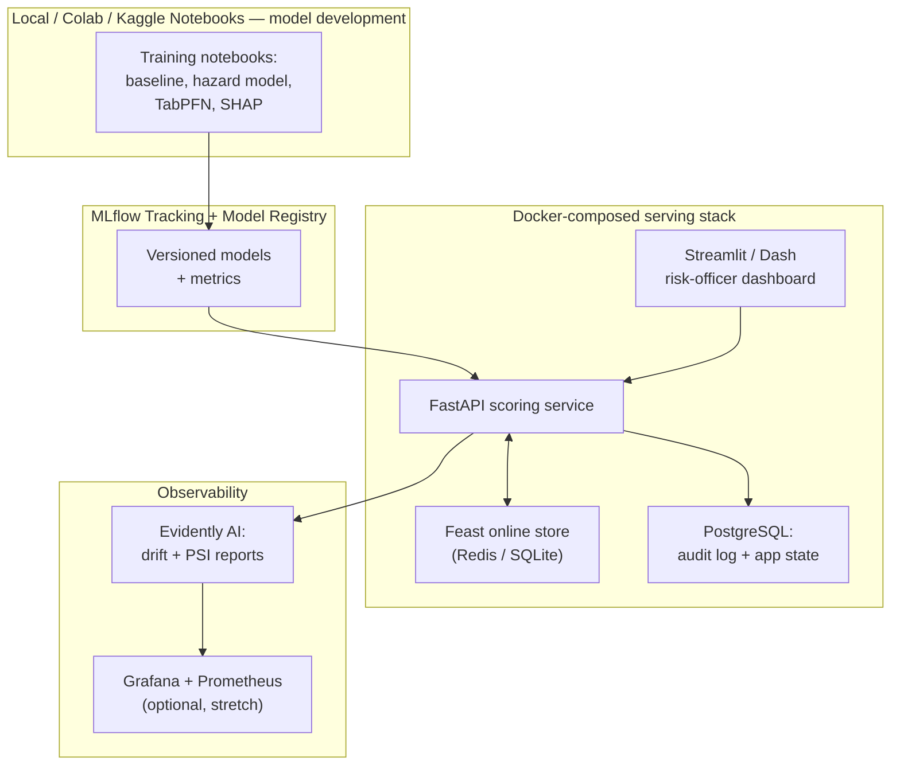

**Why this is buildable on a laptop:** every box above is either a Python library that runs on CPU (LightGBM, scikit-learn, SHAP, NetworkX, lifelines), a small pretrained model that runs on CPU or a free Colab T4 GPU (`all-MiniLM-L6-v2`, FinBERT, TabPFN), or a lightweight open-source service that runs comfortably in Docker Compose on a single machine (FastAPI, PostgreSQL, Redis, Streamlit). Nothing in this architecture requires a paid cloud subscription or a GPU cluster — this is stated explicitly in the Solution Definition Document's own compute assumptions and is preserved unchanged here.

---

## 6. Data Strategy & Sources

### 6.1 The core constraint and how the plan resolves it

The real IDBI sandbox dataset (with genuine GST/UPI/Account-Aggregator/EPFO fields) is only released to shortlisted teams, and even then is synthetic. There is also **no public Indian dataset with real, granular GST/UPI/Account-Aggregator data** — this is sensitive, consent-gated data by design, which is the entire reason the Account Aggregator consent framework exists. The correct engineering response is not to hunt for a dataset that doesn't exist; it is to **build and validate the full pipeline now on public proxy datasets that share the same structural problem** (alternative-data-based lending to underserved/thin-file borrowers), with every feature-engineering function parameterized by column name so the IDBI schema swap is a config change, not a rewrite, once sandbox access is granted.

### 6.2 Master Data Source Table

| # | Dataset | Role in this plan | Link |
|---|---|---|---|
| 1 | **Home Credit Default Risk** (Kaggle) | Primary proxy — structured + alternative data, thin-file framing, multiple relational tables (bureau, previous applications, installments, POS/credit-card balances) | https://www.kaggle.com/c/home-credit-default-risk |
| 2 | **Give Me Some Credit** (Kaggle) | Secondary proxy — explicitly framed as "predict default over the next two years," structurally close to the 12-month PD task | https://www.kaggle.com/c/GiveMeSomeCredit |
| 3 | **Freddie Mac Single-Family Loan-Level Dataset** | Longitudinal, loan-level, monthly-performance panel — the correct shape for the discrete-time hazard model (§9.2) | https://www.freddiemac.com/research/datasets/sf-loanlevel-dataset |
| 4 | **Statlog German Credit Data** (UCI) | Small dataset for a fast first pipeline pass; also the exact dataset TabPFN's own *Nature* paper used for its showcase experiments | https://archive.ics.uci.edu/dataset/144/statlog+german+credit+data |
| 5 | **HMEQ (Home Equity)**, 5,960 loans | Small, classic scorecard-tutorial dataset for a rapid end-to-end smoke test before scaling to Home Credit | Kaggle mirrors ("HMEQ dataset Kaggle") |
| 6 | **Financial PhraseBank** | Free-text stand-in for GST filing remarks / loan-officer notes before real text is available | https://huggingface.co/datasets/financial_phrasebank |
| 7 | **IDBI Innovate sandbox data** (post-shortlist) | Final, authoritative dataset — replaces all of the above once granted | Provided directly by organizers |

### 6.3 Data Schema — Entity Relationship Diagram

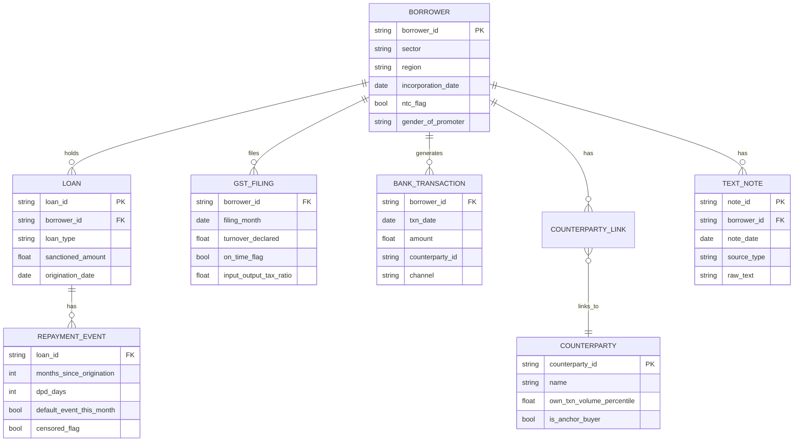

### 6.4 AA/GSTN/OCEN-Native Ingestion Design

Most incumbent NBFC stacks still treat bank-statement and GST ingestion as a bolt-on OCR/manual-upload step. By FY25, Account-Aggregator-enabled loan disbursal in India had crossed ₹1.6 lakh crore with 208% year-on-year growth, GSTN is now a live Financial Information Provider inside the AA framework, and AA-based consent flows cut bank-statement-driven onboarding drop-off by up to 60% versus manual PDF upload. Building **AA/GSTN-native from day one** is therefore not a speculative feature — it is catching up to where the rails already are.

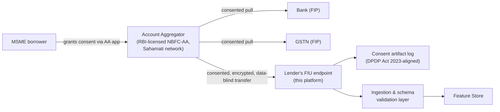

**For the hackathon build specifically:** since no team can obtain a live AA license or real consented data in a hackathon window, this layer is implemented as a **documented, code-ready mock** — a consent-artifact schema modeled directly on the AA framework's own object model (FIP/FIU/consent-handle structure per the RBI Master Direction — NBFC Account Aggregator (Reserve Bank) Directions, 2016), populated with the Home Credit dataset's alternative-data columns (telco, transactional fields) as structural stand-ins. This demonstrates the *architecture* is AA-native without requiring an actual AA integration, and is explicitly called out as such in the pitch rather than implied to be live.

### 6.5 Data Quality Plan

- **Missingness is a signal, not noise.** GST filing gaps, missing bureau history, and blank financial-statement fields are common for real MSMEs — the WOE-binning step (§9.1) treats missingness as its own coarse bin rather than imputing or dropping rows silently.
- **Automated data-quality gate before every training run**, using `great_expectations`-style checks: range validation on ratios, null-rate thresholds per column, duplicate-row detection, and schema-drift detection between the sandbox dataset and the production feature store.
- **OCR/entity-extraction error tolerance** for the text pipeline (§8.3): free-text fields are passed through a light regex/keyword pre-clean pass before embedding, and any field with more than a threshold fraction of non-parseable characters is flagged rather than silently embedded as noise.
- **Synthetic-vs-real data provenance tagging.** Every row carries a `data_provenance` flag (`real_sandbox` vs `public_proxy` vs `synthetic_graph`) so that at demo time, and later in production, it is always possible to audit exactly which claims rest on which data source — directly answering the literature's repeated warning about undocumented synthetic-data use.

---

## 7. Borrower Segmentation Strategy

### 7.1 Why segmentation comes before any modeling

A single model trained across every segment underperforms on each individual segment because the actual risk drivers differ structurally — a home loan's key driver is property-value trend; an MSME working-capital loan's key driver is cash-flow volatility; a manufacturing term loan's key driver is machinery-utilization and export-order backlog. The problem statement's explicit ask for *"suitable analytical methods for different loan types and borrower profiles"* is a direct instruction to segment first, model second.

### 7.2 Segmentation Decision Tree

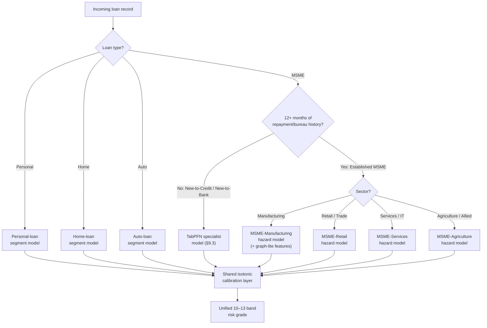

### 7.3 Segment-specific risk-driver emphasis

| Segment | Primary risk signals to weight | Rationale |
|---|---|---|
| MSME – Manufacturing | Inventory turnover, machinery utilization, export-order backlog, input-tax-credit anomalies, anchor-OEM payment delay (graph-lite) | Chakan/Pimpri-Chinchwad/Talegaon-style auto-ancillary clusters are payment-delay-sensitive and EV-transition-exposed |
| MSME – Retail / Trade | Daily UPI/POS transaction velocity, footfall proxies, seasonal cash-flow coefficient of variation | Retail risk is short-cycle and cash-flow-driven, not asset-driven |
| MSME – Services / IT | Client-contract recurrence, employee-headcount stability, recurring-revenue ratio | Services risk is relationship/contract-driven, not inventory-driven |
| MSME – Agriculture / Allied | Seasonality index, monsoon/weather proxy, commodity-price volatility | Structurally different repayment cadence (harvest-cycle-aligned) |
| New-to-Credit / New-to-Bank | Whatever alternative signals exist (UPI velocity, utility payments, minimal GST history) | Gradient boosting under-trains on <1,000 rows; TabPFN is purpose-built for this regime |

**Output of this layer:** every downstream record carries a `loan_type` and `data_richness` tag that determines routing through the rest of the pipeline (see §5.3 sequence diagram).

---

## 8. Feature Engineering

### 8.1 Structured Features (all segments)

| Category | Specific features | Notes |
|---|---|---|
| Repayment behavior | Days-past-due (DPD) history, EMI delay frequency, count of SMA-0/SMA-1/SMA-2 occurrences in trailing 12 months | SMA categories are RBI's own existing early-stress taxonomy (§12.4) |
| Financial ratios | Debt-to-Income, utilization ratio (used credit / sanctioned limit), liquidity ratio, current ratio | Standard scorecard variables |
| Trend / volatility | Rolling 3/6/12-month average inflow, coefficient of variation of monthly cash flow | Higher volatility = higher MSME-specific risk |
| Bureau | Existing credit lines, recent enquiry count, prior default flags | From CIBIL/CRIF/Experian-equivalent proxy fields in Home Credit's `bureau.csv` |
| MSME-specific alternative | GST on-time filing rate (trailing 12 months), input-tax-credit-to-output-tax ratio (anomaly signal), UPI/transaction velocity, counterparty diversity | The literal "structured + unstructured" ask from the problem statement, structured half |

**Method (applied to every candidate variable):** coarse binning (5–10 bins, equal-frequency or decision-tree-based) followed by a Weight-of-Evidence transform — `WOE = ln(%non-events in bin / %events in bin)` — computed in parallel with the raw (non-binned) value, since the gradient-boosting/hazard model consumes raw values while the logistic baseline consumes WOE values.

### 8.2 Graph-lite Features (MSME segment specifically — Tier 2 flagship, detailed build in §12.1)

| Feature | Definition | Signal captured |
|---|---|---|
| Counterparty concentration | Share of total transaction value from the single largest counterparty | High concentration = fragile if that relationship breaks |
| Degree centrality | Count of distinct counterparties | Diversification proxy |
| Anchor-linkage flag | Binary: is the top counterparty itself large/stable (proxy: its own transaction-volume percentile)? | Distinguishes "safe anchor dependency" from "risky anchor dependency" |
| Network stability | Month-over-month churn rate of the counterparty set | Relationship instability as an early, pre-financial-statement signal |

### 8.3 Text / Unstructured Features

| Step | Method | Library |
|---|---|---|
| 1. Sentence embedding | Convert every free-text field (loan officer notes, loan-purpose description, GST remarks) into a fixed 384-dim vector | `sentence-transformers`, model `all-MiniLM-L6-v2` |
| 2. Financial-domain sentiment | Positive/negative/neutral classification of financial text | `ProsusAI/finbert` (pretrained, fine-tuned on Financial PhraseBank) |
| 3. Dimensionality reduction | PCA to 10–20 components so text doesn't overwhelm the structured feature set | `scikit-learn` PCA |
| 4. Distress-keyword flag | Cheap, highly interpretable binary flags for words like "delay," "dispute," "stoppage," "closure" | Simple regex pass — gives SHAP something concrete to point to |

### 8.4 Temporal / Behavioral & Macro Features

- Months-since-origination (the single feature that lets the hazard model learn how risk changes over a loan's life — this is the entire point of the survival framing, see §9.2).
- Sector-level macro indicators (commodity price index for agriculture-linked MSMEs, PMI/auto-production index for Pune's manufacturing cluster, interest-rate trend).
- Seasonality index per sector (harvest cycle for agriculture, festive-season demand spike for retail).

---

## 9. Core Modeling Pipeline

### 9.1 Baseline — WOE-Binned Logistic Regression Scorecard

**Why build the "boring" model first:** this is the architecture almost every bank runs in production today (data → coarse binning → WOE transform → logistic regression → points-based scorecard → cutoff policy). Basel-style regulation requires documented, validated models, and logistic regression has decades of established validation methodology while tree/NN validation standards are still maturing industry-wide. Building this first proves the team understands *why* the "outdated" architecture persists (regulatory explainability, not inertia) before improving on it — and gives a defensible number to measure genuine uplift against.

- **Library:** `scikit-learn` `LogisticRegression`, combined with `optbinning` for automated WOE binning.
- **Target:** binary — defaulted within the observation window (0/1).
- **Inputs:** WOE-transformed structured features only (§8.1) — deliberately excludes graph and text features, since this model represents "what exists today."
- **Starting hyperparameters:** `penalty='l2'`, `C=1.0`, `class_weight='balanced'`, `max_iter=1000`.
- **Training data:** `application_train.csv` from Home Credit Default Risk, joined with `bureau.csv`.
- **Compute:** CPU, local machine or Colab free tier — trains in seconds to low minutes even on the full 307K-row dataset.
- **Output:** single-point 12-month PD, plus an optional points-based scorecard for interpretability.

### 9.2 Core Engine — Segment-wise Discrete-Time Survival / Hazard Model

This is the model that directly answers *"12 months in advance"* correctly. Instead of one binary outcome, it predicts a **hazard curve**: P(default in month 1), P(default in month 2), ..., P(default in month 12), for every account.

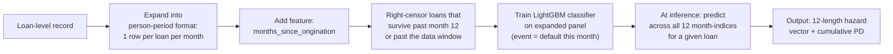

**Option A — Discrete-time hazard via LightGBM on person-period data (recommended primary):**

- Convert loan-level data into "one row per loan-month" panel format with a binary event indicator (did default happen in *this specific month*?).
- Loans that survive to month 12, or to the end of the observation window, without defaulting are **right-censored**, not treated as "safe."
- Feature set: same structured/graph-lite/text features as §8, plus `months_since_origination`.
- **Starting hyperparameters:** `num_leaves=31`, `learning_rate=0.05`, `n_estimators=1000` with `early_stopping_rounds=50`, `max_depth=-1`, `min_child_samples=20`, `subsample=0.8`, `colsample_bytree=0.8`, `scale_pos_weight` set to the negative:positive class ratio, `objective='binary'`, `metric='auc'`.
- **Training data:** Home Credit for structured-feature richness (aggregate `bureau.csv`, `bureau_balance.csv`, `previous_application.csv`, `POS_CASH_balance.csv`, `installments_payments.csv`, `credit_card_balance.csv` into per-applicant summary features — this aggregation step is where most real predictive power comes from, more than model choice itself); Freddie Mac's loan-level panel for genuinely longitudinal practice data.
- **Compute:** CPU, Google Colab or Kaggle Notebooks (Kaggle Notebooks specifically convenient since Home Credit is natively hosted there).

**Option B — Cox Proportional Hazards via `lifelines` (statistical alternative, faster to fit):**

- Two columns per loan: `duration` (months to event or censoring) and `event` (1 if default, 0 if censored).
- Use the `strata` argument on `loan_type` when training one combined model across segments that share a covariate structure but need different baseline hazard shapes — a useful middle ground for the MSME segment specifically when row counts are thin.
- **Starting hyperparameters:** `penalizer=0.1` (L2 regularization — increase if coefficients are unstable, common with correlated financial ratios), `l1_ratio=0.0`.
- **Evaluation:** built-in concordance index (the survival-data equivalent of AUC), plus `lifelines`' own `survival_probability_calibration()` for calibration checking.
- **Compute:** CPU-only, fits quickly even on tens of thousands of rows.

**Which to ship:** build both; report whichever performs better on validation. Option A is more flexible (handles non-linear, non-proportional effects natively via gradient boosting); Option B is the more classically "correct" survival model and gives judges a second, independent validation angle (concordance index) practically for free.

### 9.3 Specialist Model — TabPFN for the Sparse / Thin-File Segment

For the New-to-Credit/New-to-Bank MSME sub-segment, where there simply aren't enough rows per borrower for gradient boosting to learn reliably, this plan uses **TabPFN** — a pretrained tabular foundation model that performs in-context (Bayesian-style) inference in a single forward pass, with **no task-specific training loop**.

- TabPFN's original *Nature* (2025) publication showed it outperforming previous methods on datasets up to 10,000 rows by a wide margin — exactly the regime NTC/NTB MSME lending sits in.
- **Practical constraint:** local CPU inference is only recommended under ~1,000 samples; beyond that, use either a modest GPU (an 8GB-VRAM card is enough) or the hosted `tabpfn_client` package, which needs no GPU on the local machine at all — the simplest path for a hackathon team without dedicated GPU hardware. Given the NTC/NTB segment is by definition small-row-count, this is not a practical limitation here.
- **Privacy note:** the hosted `tabpfn_client` path sends data to Prior Labs' servers for inference. This is fine for public proxy datasets during prototyping; re-evaluate before running real sandbox data through the hosted option, and prefer the local package if the sandbox data has confidentiality constraints.
- **Training data:** German Credit Data (the same dataset TabPFN's own creators used for their proof-of-concept) for a first test; a random 200–500-row subsample of Home Credit to simulate the real thin-file regime for validation.
- **Explainability:** the `tabpfn-extensions` package's interpretability module wraps SHAP specifically for TabPFN's prediction interface, keeping explainability consistent across the whole system (§11).
- **Honest framing for the pitch:** a 2026 academic evaluation of foundation models for credit risk conjectures pretraining-on-out-of-domain-data is *particularly* promising for small-data settings like SME lending, but is explicitly careful to flag this as an open research question, not a guaranteed win — this caveat should be stated in the pitch, not hidden, since overclaiming here is exactly the kind of thing a technically literate judge will catch.

### 9.4 Calibration Layer — the literal implementation of "common interpretation framework"

- **Method:** `sklearn.isotonic.IsotonicRegression`, fit **per segment** on a held-out calibration split (never on the same data used for training/validation).
- **Why non-negotiable:** without this step, four separately-trained segment models produce probability outputs that are not on the same scale — a "15% PD" from the Personal-loan model and a "15% PD" from the MSME model would mean different real-world likelihoods. This single step is what makes "consistent, comparable, actionable outputs across all MSME loans" literally true rather than aspirational.
- **Validation:** reliability diagram — bin predicted probabilities, plot against observed default rate per bin; should track the diagonal after calibration.
- **Output mapping:** calibrated PD → a shared 10–13-band letter/number grade (A→D or 1–10 scale), deliberately mirroring the granularity of CRIF High Mark's own 13-point MSME Rank so the output format is immediately legible to a banking judge.

### 9.5 Multimodal Fusion Strategy

Two fusion strategies exist in the literature, and the choice matters:

- **Late fusion** (train separate sub-models per data source, combine their scalar outputs with a meta-learner) is what most current commercial platforms do — and it is exactly the "scalar compression" gap identified across the research corpus: compressing a rich temporal/textual signal into one number before the meta-learner discards the very information that made the sub-model useful.
- **Intermediate fusion with cross-attention** — each modality (structured, graph-lite, text) is encoded into a dense intermediate representation, and a lightweight attention mechanism aligns them before final scoring, so the model can, for example, automatically up-weight a concerning loan-officer note when the transaction-embedding stream also shows rising overdraft utilization.

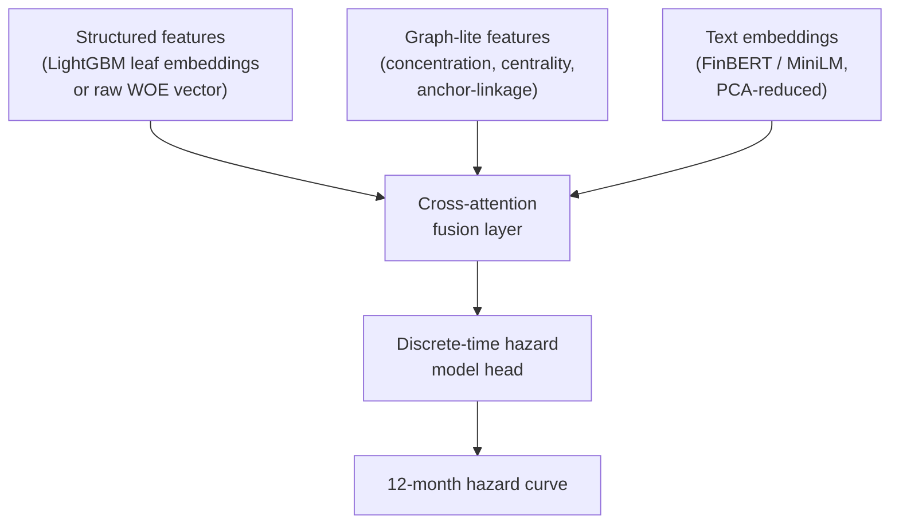

**Hackathon-realistic implementation:** the full learned cross-attention layer is a Tier 3 stretch item (requires a small custom PyTorch model and more training-iteration time than a hackathon window comfortably allows). What is fully buildable now is the **intermediate step**: concatenating dense (not scalar) text-embedding and graph-lite feature vectors directly onto the structured feature matrix *before* the LightGBM hazard model, which already captures most of the "don't compress to a scalar first" insight — this is the concrete Tier 1/2 implementation, with the learned attention layer named explicitly as the Tier 3 upgrade path (§12.1).

### 9.6 Uncertainty Quantification (lightweight, Tier 2)

Rather than only a point PD, the calibration-set residuals are used to attach a **confidence band** to every prediction (e.g., "PD 42% ± 6%, calibrated on n=380 comparable accounts"). Cases where the band is wide, or where TabPFN and the gradient-boosting hazard model disagree by more than a set margin, are flagged for **mandatory human review** — a concrete, cheap way to answer the literature's repeated "how confident is the model, and when should a human look at this" gap without building full conformal prediction in the hackathon window (that remains a named Tier 3 upgrade, §12.10).

### 9.7 Risk-Band-to-Action Mapping

| Calibrated 12-month PD | Risk grade | Recommended action |
|---|---|---|
| 0–20% | Low (Grades A–B) | Normal monitoring cadence |
| 20–50% | Medium (Grades C–D) | Monthly review; enter Watch List |
| 50–80% | High (Grades E–F) | Enhanced monitoring; proactive restructuring offer |
| Above 80% | Critical (Grades G+) | Immediate intervention; exposure-limitation protocol |

This table is the direct mechanism behind Gap G1 (§4.7) — every prediction ships with an action, not just a number.

---

## 10. Class Imbalance & Optimization Strategy

### 10.1 Why SMOTE is explicitly avoided as the primary technique

Loan defaults are rare events — imbalance ratios in enterprise credit datasets range from roughly 50:1 to as extreme as 1,133:1 in some published studies. SMOTE (Synthetic Minority Over-sampling) is ubiquitous in academic literature but is increasingly abandoned in large-scale production systems: in high-dimensional data it frequently generates synthetic minority examples that blur decision boundaries, causing overfitting that inflates validation metrics without improving genuine out-of-time performance. This plan treats that finding as a hard design constraint, not a footnote.

### 10.2 What is used instead

- **Class-weighting** (`class_weight='balanced'` for the logistic baseline; `scale_pos_weight` for LightGBM) as the default, cheap, well-understood correction.
- **Focal Loss** as the primary optimization-level fix for the hazard model, when class-weighting alone under-performs:

  `FL(p_t) = -α_t · (1 - p_t)^γ · log(p_t)`

  where `p_t` is the model's estimated probability for the true class, `α_t` is a weighting factor addressing baseline imbalance, and `γ` (typically ≥ 0) is a focusing parameter. As the model becomes confident on easy majority-class (performing-loan) examples, the `(1-p_t)^γ` term decays toward zero, automatically down-weighting their gradient contribution and forcing the optimizer to concentrate on the rare, ambiguous, hard-to-classify patterns that actually precede a default. This is explained in plain English on the risk-officer dashboard as: *"the model is deliberately taught to spend most of its learning effort on the borderline cases that look like they might turn bad, rather than getting good at recognizing the many obviously-healthy loans."*
- **Threshold tuning against expected business cost**, not just F1/accuracy — see §15.4.

### 10.3 Validation-integrity rule tied to imbalance

Because defaults are rare, k-fold cross-validation with random shuffling can put future information in the training fold. This plan mandates **strict out-of-time (OOT) validation** everywhere (§15.2) specifically because temporal leakage combined with class imbalance is the single most common source of inflated, non-reproducible "accuracy" claims flagged repeatedly across the literature review.

---

## 11. Explainability & Decision-Support Layer

### 11.1 Why this is non-negotiable, not a nice-to-have

Banking is a regulated context where "the model said so" is not an acceptable answer for a credit decision. RBI's FREE-AI framework (13 August 2025) makes this an explicit supervisory expectation under its **"Understandable by Design"** Sutra — black-box decisioning for loan approvals is not permitted; every risk score must come with human-readable reasoning that a regulatory auditor and the borrower can both follow.

### 11.2 Three-Level Explainability Pipeline

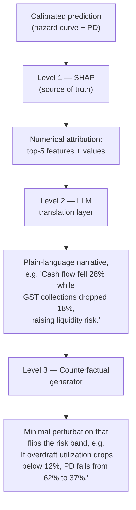

**The hard architectural rule (directly resolving Gap D2, §4.4):** the LLM is used **only** to translate already-computed, verified SHAP values into prose. It is never asked to independently judge creditworthiness or invent a reason that wasn't in the SHAP output. This exact "SHAP as source of truth, LLM as narrative layer" pattern is what 2026 research on LLM explainability for credit risk explicitly recommends, precisely because free-generated LLM explanations risk being unfaithful to the actual model and cannot be trusted in a regulated decisioning pipeline.

- **Level 1 — SHAP:** `shap.TreeExplainer` for the LightGBM/hazard model and the logistic baseline (`shap.LinearExplainer`); the `tabpfn-extensions` interpretability module for the TabPFN specialist. Output: global summary plot for model documentation, per-prediction force plot for the individual "why" explanation.
- **Level 2 — Narrative translation:** a small, tightly-scoped prompt template that receives *only* the top-5 SHAP feature/value pairs and produces one short paragraph in fixed structure — it is not given free rein over the case file, which keeps the risk of hallucinated detail low and auditable.
- **Level 3 — Counterfactual:** a constrained search (or, more simply for a hackathon build, a grid re-scoring of the same model over small perturbations to the top 2–3 SHAP-flagged features) that reports the smallest realistic change that would move the account to the next-better risk band — directly resolving Gap D3.

### 11.3 Output Format Attached to Every Prediction

1. Calibrated 12-month cumulative PD (single percentage).
2. Monthly hazard curve (12 values) — for the survival model specifically; baseline and TabPFN outputs are clearly labeled as single-point estimates.
3. Standardized risk band (§9.7).
4. Top-5 SHAP-based risk drivers, in plain language.
5. Counterfactual recommendation.
6. Recommended action flag (monitor / review / escalate / restructure).

This six-part structure is the literal, checkable answer to the problem statement's *"common interpretation framework to ensure consistent, comparable, and actionable outputs."*

---

## 12. The Ten Differentiators — Deep-Dive Build Guides

This section is the answer to "what makes this groundbreaking, not just another scorecard." Every item below is cross-referenced from the Gap Matrix (§4) and is either fully buildable in the hackathon window or explicitly marked as a documented Tier-3 roadmap item.

### 12.1 Graph-Based Supply-Chain Contagion Engine (flagship differentiator)

**The problem this solves:** Pune's MSME ecosystem is a dense web of Tier-1/Tier-2/Tier-3 auto-ancillary suppliers feeding large OEMs across Chakan, Pimpri-Chinchwad, Talegaon, and Ranjangaon. A conventional scorecard evaluates a Tier-3 supplier's balance sheet in isolation and is structurally blind to the fact that its anchor OEM just delayed payments — even though that shock will hit the Tier-3 firm's cash flow within weeks. 2025 research on graph-based SME credit risk (large-scale supply-chain graphs, tens of millions of nodes) reports AUC gains of 4–14 points from modeling this contagion explicitly versus tabular-only baselines, and no commercially deployed Indian MSME product currently does this in production.

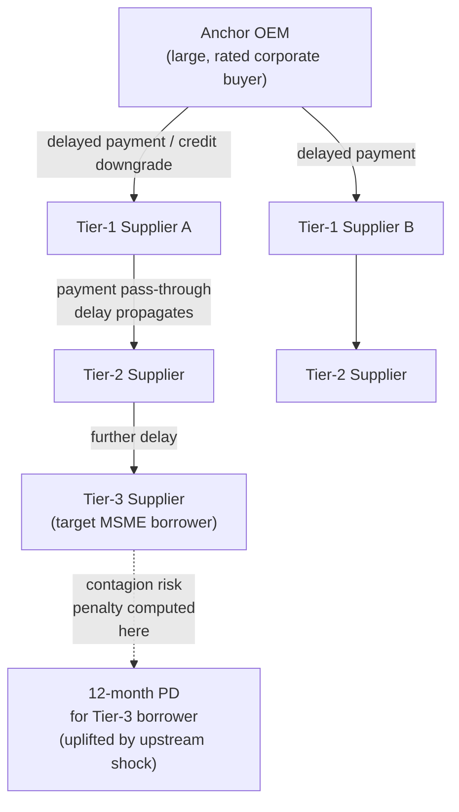

**Build path, staged honestly:**

| Stage | What is built | Tier | Library |
|---|---|---|---|
| 1 | Bipartite firm↔counterparty graph from GST e-way-bill / UPI transaction data (synthetic for prototyping — §6.1 caveat applies) | Tier 2 (build now) | `networkx` |
| 2 | Graph-lite tabular features: counterparty concentration, degree centrality, anchor-linkage flag, network stability (churn) — fed as ordinary columns into the hazard model | Tier 2 (build now) | `networkx.degree_centrality()`, manual aggregation |
| 3 | Synthetic-graph validation: generate N firms with a deliberate mix of "concentrated" (1–2 counterparties) vs. "diversified" firms, and verify the Stage-2 feature code correctly separates them **before** wiring to real data | Tier 2 (build now) | `networkx` + `numpy` random graph generation |
| 4 | A trained Graph Attention Network (heterogeneous edges: direct transaction layer + common-ownership/guarantor layer) that learns risk-propagation weights end-to-end rather than hand-computing centrality | **Tier 3 — roadmap** | `PyTorch Geometric` (https://pytorch-geometric.readthedocs.io/) or `DGL` (https://www.dgl.ai/) |

**Why Stage 4 is honestly scoped as Tier 3:** training a real GAT/GraphSAGE model needs a graph with genuine relational density (real invoice/e-way-bill data at scale) and multiple training epochs on GPU — neither is available inside a hackathon window on synthetic data without risking a model that looks trained but has learned nothing meaningful. Stage 2's hand-computed features capture a large fraction of the same underlying insight (a firm's position in its trading network carries default signal) for a fraction of the engineering cost, and is what should actually be demoed live.

### 12.2 AA/GSTN/OCEN-Native Data Architecture

Fully detailed in §6.3–6.4. The engineering point worth restating here: this is a **pipeline architecture decision**, not a modeling decision. Competing teams that treat GST/bank-statement ingestion as a bolt-on OCR step will have a structurally slower, higher-drop-off onboarding path even if their model is equally good. Designing the ingestion layer around the AA/GSTN/OCEN consent object model from day one — even while using proxy data during the hackathon — is what lets this system plug into the real rails without an ingestion-layer rewrite later.

### 12.3 The Narrative & Counterfactual Advisor — Productization Details

Beyond the conceptual three-level pipeline in §11, the following engineering details matter for a working demo:

- **Latency budget:** SHAP computation on a single tree-ensemble prediction is millisecond-scale; the LLM narrative call is the latency bottleneck. Cache narratives per (risk-band, top-3-driver-combination) tuple rather than calling the LLM fresh on every identical explanation pattern — this keeps a live demo responsive.
- **Guardrail:** the narrative prompt template is deliberately rigid (fixed structure: driver → direction → magnitude → risk implication) rather than open-ended, and the response is validated against the numeric SHAP values before display — if the LLM's stated percentage doesn't match the SHAP output, the system falls back to a templated (non-LLM) sentence rather than showing an unverified number.
- **Audit logging:** every generated narrative is stored alongside the exact SHAP values it was derived from, so a regulator can later verify the explanation was faithful to the model, not retro-fitted.

### 12.4 Regulatory-Native Early-Warning Mapping

**The gap:** RBI's own Special Mention Account (SMA) framework — SMA-0 (1–30 days overdue), SMA-1 (31–60), SMA-2 (61–90), NPA (90+) — is the existing industry early-warning system, and it is **structurally reactive**: SMA-0, its *earliest* signal, only fires one day after a payment is already missed. This plan's ML-derived hazard curve is explicitly positioned as a **forward-looking layer sitting ahead of** this existing regulatory framework, not a replacement for it — and every ML-derived alert is mapped onto RBI's own codified indicator taxonomy from the July 2024 Master Directions on Fraud Risk Management, so flagged accounts are immediately usable for existing CRILC (Central Repository of Information on Large Credits) reporting and audit workflows rather than being a parallel, unexplained score.

```mermaid
stateDiagram-v2
    [*] --> Performing
    Performing --> WatchList: ML hazard curve crosses\nsegment-calibrated threshold\n(e.g. 12-month PD > 20%)
    WatchList --> HighAlert: PD > 50% OR an EWS indicator\nfires (GST turnover drop,\ncheque bounce, RTGS to\nunrelated party, cash-withdrawal anomaly)
    HighAlert --> Critical: PD > 75% OR SMA-1/SMA-2\ndelinquency confirms the signal
    Critical --> NPA_Stage3: 90+ DPD — regulatory NPA\nper RBI IRAC norms; Stage 3 ECL\nunder Ind AS 109
    WatchList --> Performing: Risk factors resolve
    HighAlert --> WatchList: Restructuring succeeds
    NPA_Stage3 --> [*]
```

| ML-derived trigger | Mapped RBI indicator | Regulatory action this enables |
|---|---|---|
| GST turnover drop >X% month-over-month | "Default in payment to statutory bodies" family of EWS indicators | Feeds existing bank EWS/RFA workflow |
| Sudden spike in cash withdrawal relative to account activity | "Heavy cash withdrawal in loan accounts" | Existing RFA escalation path |
| Large RTGS transfer to an unrelated, newly-added counterparty | "High-value RTGS to unrelated parties" | Existing RFA escalation path |
| Repeated ad-hoc credit-limit requests | "Frequent ad-hoc sanction requests" | Existing RFA escalation path |
| PD crosses Stage-1→Stage-2 threshold | Ind AS 109 "significant increase in credit risk" | Triggers lifetime-ECL provisioning review |

This mapping is what turns a data-science output into something a bank's existing compliance workflow can consume without inventing a parallel process.

### 12.5 FREE-AI-Aligned Governance UX

RBI's FREE-AI Committee Report (released 13 August 2025) sets out seven guiding **Sutras** across six pillars with 26 recommendations. The gap identified across the research corpus is not that teams don't *know* about governance requirements — it's that almost nobody **builds the actual UX**, treating it instead as an external compliance document. This plan builds it as real interface components.

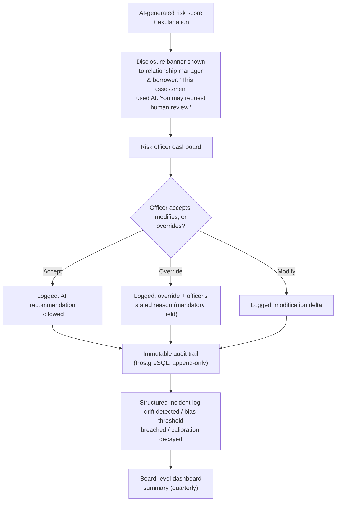

| FREE-AI Sutra | Concrete feature built |
|---|---|
| Understandable by Design | Three-level explainability output (§11) attached to every score, not available on request only |
| People First / Trust is the Foundation | Disclosure banner shown before the score is acted on; final override authority always rests with a human |
| Accountability | Append-only audit log of every prediction, every override, every reason given |
| Fairness and Equity | Sector/region/gender-of-promoter disparate-impact dashboard (§12.6) |
| Safety, Resilience & Sustainability | Structured AI-incident log (drift, bias-threshold breach, calibration decay) feeding a board-level summary view |
| Protection (data privacy) | Consent-artifact logging aligned to the Digital Personal Data Protection Act, 2023, modeled on the AA framework's own consent object (§6.4) |

*Source: RBI, "Framework for Responsible and Ethical Enablement of Artificial Intelligence in the Financial Sector" (FREE-AI Committee Report), 13 August 2025 — https://rbidocs.rbi.org.in/rdocs/PublicationReport/Pdfs/FREEAIR130820250A24FF2D4578453F824C72ED9F5D5851.PDF*

### 12.6 Fairness & Bias Audit Dashboard

India's regulatory fairness lens under FREE-AI's "Fairness and Equity" Sutra is broader than the US protected-class framing most Western AI-lending vendors build for. This plan's fairness dashboard slices **disparate impact** (approval rate, average calibrated PD, false-positive rate) by:

- Sector (manufacturing vs. retail vs. services vs. agriculture)
- Region/geography (e.g., industrial-belt MSMEs vs. peri-urban/rural MSMEs)
- Gender-of-promoter (a specific, named MSME-sector equity dimension, distinct from Western fair-lending law)

Implementation is a straightforward group-by aggregation over the calibrated-score output table, refreshed on the same cadence as the drift monitor (§13.3) — genuinely low engineering cost for a differentiator almost no reviewed commercial product has publicly demonstrated.

### 12.7 Portfolio Stress-Testing & Scenario Simulator

A self-serve tool for risk officers to answer "what happens if...?" — common in large-corporate Basel/CCAR-style stress testing, rare in MSME-book tooling specifically.

**Mechanism:** re-score the entire (or a filtered slice of the) loan book by systematically perturbing specific input features — e.g., a −15% revenue shock, a +200bps interest-rate shock, a sector-specific demand shock — and re-running the already-trained calibrated model over the perturbed feature set. This requires no new model training; it is pure re-inference, making it cheap to build once the core pipeline (§9) exists.

**Output:** a before/after shift in the portfolio's risk-grade distribution and aggregate expected loss (`EL = PD × LGD × EAD`, the standard Basel/Ind-AS-109 formulation), displayed as a simple distribution-shift chart on the dashboard (§18).

### 12.8 Unified Cross-Segment Interpretation Framework — Productization

Building on the calibration mechanics in §9.4, this is the customer-facing artifact: a single table, always rendered the same way regardless of which underlying segment model produced the score.

| Segment | Underlying model | Raw score | Calibrated 12-month PD | Unified grade |
|---|---|---|---|---|
| MSME – Manufacturing (established) | Discrete-time hazard (LightGBM) | 0.71 | 34% | C |
| MSME – Retail (established) | Discrete-time hazard (LightGBM) | 0.58 | 33% | C |
| MSME – Services (NTC/thin-file) | TabPFN | 0.62 | 35% | C |
| Personal loan | Discrete-time hazard (LightGBM) | 0.44 | 12% | A |

The point being demonstrated: three structurally different models, on three structurally different data regimes, land on **the same interpretable scale** — this table, reproduced live in the demo, is the single most direct proof that the "common interpretation framework" requirement is actually solved rather than asserted.

### 12.9 TabPFN Thin-File Specialist — Validation Protocol

To make the TabPFN choice (§9.3) credible rather than a novelty pick, the pitch includes a direct, honest comparison: train a LightGBM model on the *same* small thin-file subsample (200–500 rows) that TabPFN uses, and report AUC/KS for both side by side. TabPFN's expected advantage in this exact regime (small-sample tabular inference) is the story; showing the comparison — rather than asserting it — is what makes the differentiator credible to judges.

### 12.10 Tier 3 Roadmap — Named, Not Hand-Waved

Every item below is presented as a real next-phase engineering task with its own library and rationale, specifically because judges reward technical maturity more than false completeness.

| Roadmap item | Why it's out of hackathon scope | Concrete next step |
|---|---|---|
| Full trained GNN (GAT/GraphSAGE) for contagion | Needs real relational data at scale + multi-epoch GPU training | `PyTorch Geometric` on real GST e-way-bill graphs once sandbox access is granted |
| Neural survival models (DeepSurv, Cox-Time, DeepHit) | Marginal uplift over the discrete-time LightGBM hazard model does not justify the added training/validation complexity in a time-boxed build | `pycox` library, once a larger longitudinal dataset (Freddie-Mac-scale or the real sandbox panel) is available |
| Federated learning across lenders | Requires multiple participating institutions' infrastructure, not available to a single hackathon team | `Flower` (https://flower.ai/) or `TensorFlow Federated`, aligned with FREE-AI's data-infrastructure recommendations |
| Causal-uplift reasoning (why did risk actually rise, not just what correlates) | Needs either experimental variation or substantially more data than a hackathon dataset provides to estimate credible causal effects | `DoWhy` / `EconML` (https://github.com/py-why/dowhy, https://github.com/py-why/EconML) layered on top of the existing SHAP output |
| Cross-jurisdiction domain adaptation | Out of scope for an India-specific, RBI-aligned hackathon build | Documented as a future-markets roadmap slide only |
| Conformal-prediction-grade uncertainty intervals | The lightweight confidence-band approach (§9.6) already covers the "flag for human review" use case at a fraction of the engineering cost | `MAPIE` or `crepes` conformal-prediction libraries |

---

## 13. MLOps, Monitoring & Continuous Learning

### 13.1 Feature Store as the Single Source of Truth

**Gap resolved:** inconsistent, repeated feature-engineering logic across models (Gap H5, §4.8). **Tool:** `Feast` (https://feast.dev/), an open-source feature store that separates an **offline store** (historical features for training) from an **online store** (low-latency features for real-time scoring), and guarantees **point-in-time-correct** joins so future information never leaks into training data — directly reinforcing the temporal-leakage discipline mandated in §15.2.

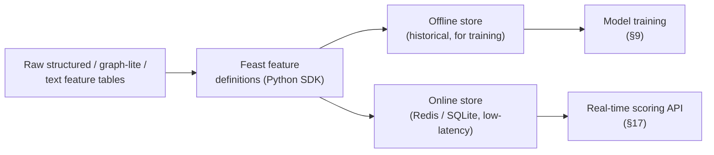

### 13.2 Experiment Tracking, Model Registry & Retraining

- **Tool:** `MLflow` (https://mlflow.org/) — every training run (baseline, hazard model, TabPFN) logs its hyperparameters, metrics (AUC, KS, Recall@FPR, Brier, PSI), and model artifact to the MLflow Tracking server; promoted models move through the MLflow Model Registry's stage transitions (`Staging` → `Production`).
- **Retraining trigger rule:** scheduled retraining runs monthly by default; an **out-of-cycle retrain is triggered automatically** when the drift monitor (§13.3) reports PSI above a set threshold on any Tier-1 feature, or when calibration-curve deviation exceeds a set tolerance — this directly resolves the "models trained once, never updated" gap (H1, §4.8).

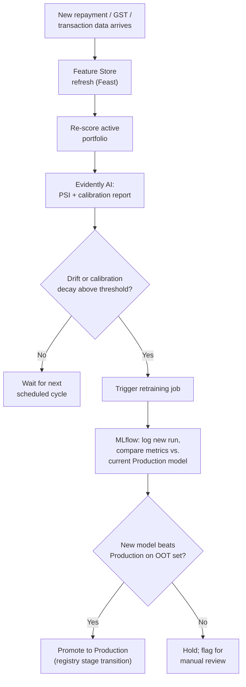

### 13.3 Drift & Calibration Monitoring, Exposed as a First-Class Dashboard

**Gap resolved:** drift/PSI monitoring buried in a data-science notebook rather than visible to a risk officer (Gap H2, §4.8). **Tool:** `Evidently AI` (https://www.evidentlyai.com/, open-source library at https://github.com/evidentlyai/evidently) — generates data-drift, prediction-drift, and calibration reports out of the box, comparing a rolling "current" window against the training-time "reference" distribution, using PSI and 20+ other statistical distance tests. The report is rendered directly inside the risk-officer dashboard (§18) in plain language — *"this model's predictions are running 8% less reliable than last quarter on the Retail segment — recommend recalibration"* — rather than a raw statistical output only a data scientist could interpret.

### 13.4 Orchestration

For a hackathon-scale demo, a single scheduled job (a cron-triggered script, or `Prefect` https://www.prefect.io/ for a slightly more production-realistic look) is sufficient to run the retrain-check loop above; `Apache Airflow` (https://airflow.apache.org/) is the natural upgrade path once this moves beyond a single-node demo, and is named explicitly in the pitch as the production orchestration choice.

---

## 14. Real-Time / Streaming Architecture for the Demo

**Gap resolved:** no real-time monitoring architecture; snapshot-only prediction (Gap B1/H4, §4.2, §4.8).

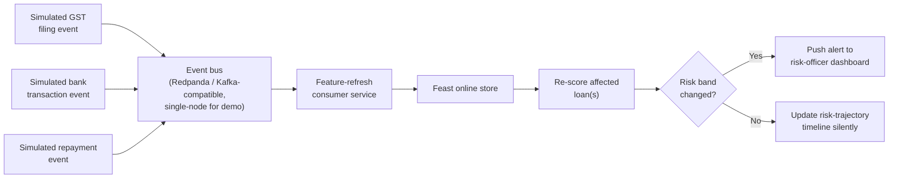

**Why Redpanda over raw Apache Kafka for a hackathon:** `Redpanda` (https://redpanda.com/) is a Kafka-API-compatible event-streaming engine that runs as a single lightweight binary/Docker container with no JVM/Zookeeper dependency, which matters enormously when the entire stack needs to run on a laptop during a demo. Because it is wire-compatible with the Kafka protocol, the architecture description and code remain valid if the team (or IDBI's own infrastructure) later swaps in `Apache Kafka` (https://kafka.apache.org/) for production scale — this is stated explicitly as a compatible, not a throwaway, choice.

**What this demonstrates live:** simulate a GST filing event showing a revenue drop for one borrower, show the event flow through the bus, watch that borrower's risk-trajectory timeline update and (if the risk band crosses a threshold) trigger a dashboard alert — all within seconds, on a laptop, with no cloud dependency. This is the single most visually compelling five-minute demo segment available in this entire architecture.

---

## 15. Evaluation Framework & Metrics

### 15.1 Full Metrics Table

| Metric | Formula / definition | Why it's reported | Reported for |
|---|---|---|---|
| AUC-ROC / Gini | Area under the ROC curve; `Gini = 2·AUC − 1` | Rank-ordering ability, insensitive to class imbalance | Every model, every segment |
| KS-statistic | Max separation between cumulative defaulter/non-defaulter score distributions | Standard Indian-bureau separation metric | Every model |
| PR-AUC | Area under Precision-Recall curve | More informative than ROC-AUC under severe imbalance | Every model |
| Recall@fixed-FPR (e.g. FPR=10%) | Of true defaulters, what fraction is caught while capping false alarms at 10% | Directly answers the operational question risk officers actually ask | Every model |
| Brier score | Mean squared error between predicted probability and actual outcome | Probability-quality check, not just ranking | Every model, post-calibration |
| Calibration curve / reliability diagram | Binned predicted-probability vs. observed-default-rate plot | Visual check that "15% PD" really means ~15% observed | Every segment, post-calibration |
| Concordance index | Survival-model analogue of AUC | Hazard model (§9.2, Option B) |
| Population Stability Index (PSI) | `Σ (Actual% − Expected%) × ln(Actual% / Expected%)` across score/feature bins | Production drift signal | Ongoing, monitored monthly (§13.3) |
| Expected Loss | `EL = PD × LGD × EAD` | Ties model output to Basel/Ind-AS-109 capital and provisioning language | Portfolio-level reporting (§12.7) |

### 15.2 Validation Protocol (mandatory, non-negotiable)

- **Strict out-of-time (OOT) split.** Train on data up to time T, validate on T+1...T+k, test on a final held-out future window. Random k-fold shuffling is explicitly banned in this design because it is the single most common source of inflated, non-reproducible performance claims flagged repeatedly across the literature (temporal leakage).
- **Segment-aware validation.** Metrics are reported *per segment*, not only in aggregate — an overall AUC of 0.80 can hide a segment where the model barely beats random.
- **Naive-baseline comparison, always.** A model that always predicts "no default" scores extremely high on raw accuracy while being useless; this number is computed and displayed next to every real metric, on every slide, as a standing methodological discipline rather than a one-off caveat.

### 15.3 Mandatory Comparison Table (template used throughout the pitch deck)

| Model | AUC-ROC | KS | Recall@FPR=10% | Brier | Naive-baseline accuracy (for contrast only) |
|---|---|---|---|---|---|
| Naive ("always no-default") | 0.50 | 0.00 | 0.00 | — | ~96–98% (shown to expose why accuracy is the wrong metric) |
| WOE Logistic baseline (§9.1) | *reported* | *reported* | *reported* | *reported* | — |
| Discrete-time hazard model (§9.2) | *reported* | *reported* | *reported* | *reported* | — |
| TabPFN (thin-file segment only) (§9.3) | *reported* | *reported* | *reported* | *reported* | — |

### 15.4 Cost-Aware Threshold Selection

Rather than optimizing purely for AUC, the final decision threshold per segment is chosen to minimize **expected business cost**: `Cost = (False Negatives × cost of a missed default) + (False Positives × cost of unnecessary investigation/restructuring)`, using the `EL = PD × LGD × EAD` framing from §12.7 to anchor the false-negative cost in real capital terms. This directly resolves Gap G3 (§4.7) — optimizing for financial impact, not only statistical separation.

---

## 16. Technology Stack — Master Table

| Layer | Tool | License / type | Link |
|---|---|---|---|
| Baseline scorecard | scikit-learn | Open-source (BSD) | https://scikit-learn.org/ |
| WOE binning | optbinning | Open-source | https://gnpalencia.org/optbinning/ |
| Gradient boosting | LightGBM | Open-source (MIT) | https://lightgbm.readthedocs.io/ |
| Gradient boosting (alt.) | XGBoost | Open-source (Apache-2.0) | https://xgboost.readthedocs.io/ |
| Gradient boosting (alt., categorical-native) | CatBoost | Open-source (Apache-2.0) | https://catboost.ai/ |
| Survival analysis | lifelines | Open-source (MIT) | https://lifelines.readthedocs.io/ |
| Survival analysis (alt.) | scikit-survival | Open-source (GPL-3.0) | https://scikit-survival.readthedocs.io/ |
| Neural survival (Tier 3) | pycox | Open-source | https://github.com/havakv/pycox |
| Thin-file specialist | TabPFN / tabpfn-client | Open-source (Apache-2.0) + hosted free tier | https://github.com/PriorLabs/TabPFN, https://github.com/PriorLabs/tabpfn-client |
| TabPFN interpretability | tabpfn-extensions | Open-source | https://github.com/PriorLabs/tabpfn-extensions |
| Class-imbalance handling | imbalanced-learn (baseline comparison only) | Open-source (MIT) | https://imbalanced-learn.org/ |
| Text embeddings | sentence-transformers (`all-MiniLM-L6-v2`) | Open-source (Apache-2.0) | https://www.sbert.net/, https://huggingface.co/sentence-transformers/all-MiniLM-L6-v2 |
| Financial sentiment | FinBERT (`ProsusAI/finbert`) | Open-source (via Hugging Face) | https://huggingface.co/ProsusAI/finbert |
| Graph-lite features | NetworkX | Open-source (BSD) | https://networkx.org/documentation/stable/ |
| GNN (Tier 3) | PyTorch Geometric | Open-source (MIT) | https://pytorch-geometric.readthedocs.io/ |
| GNN (Tier 3, alt.) | DGL (Deep Graph Library) | Open-source (Apache-2.0) | https://www.dgl.ai/ |
| Explainability | SHAP | Open-source (MIT) | https://shap.readthedocs.io/ |
| Calibration | scikit-learn IsotonicRegression | Open-source | (part of scikit-learn, above) |
| Causal inference (Tier 3) | DoWhy | Open-source (MIT) | https://github.com/py-why/dowhy |
| Causal inference (Tier 3, alt.) | EconML | Open-source (MIT) | https://github.com/py-why/EconML |
| Uncertainty (Tier 3) | MAPIE (conformal prediction) | Open-source (BSD) | https://mapie.readthedocs.io/ |
| Feature store | Feast | Open-source (Apache-2.0) | https://feast.dev/, https://docs.feast.dev/ |
| Experiment tracking / registry | MLflow | Open-source (Apache-2.0) | https://mlflow.org/ |
| Drift / calibration monitoring | Evidently AI | Open-source (Apache-2.0) | https://www.evidentlyai.com/, https://github.com/evidentlyai/evidently |
| Data-quality validation | Great Expectations | Open-source (Apache-2.0) | https://greatexpectations.io/ |
| Orchestration (light) | Prefect | Open-source (Apache-2.0) | https://www.prefect.io/ |
| Orchestration (production-scale) | Apache Airflow | Open-source (Apache-2.0) | https://airflow.apache.org/ |
| Streaming / event bus | Redpanda (Kafka-API-compatible) | Open-source (BSL→Apache after 4yrs; free to use) | https://redpanda.com/ |
| Streaming (alt., production) | Apache Kafka | Open-source (Apache-2.0) | https://kafka.apache.org/ |
| Serving API | FastAPI | Open-source (MIT) | https://fastapi.tiangolo.com/ |
| Dashboard | Streamlit | Open-source (Apache-2.0) | https://streamlit.io/ |
| Dashboard (alt., richer interactivity) | Plotly Dash | Open-source (MIT) | https://dash.plotly.com/ |
| Relational store / audit log | PostgreSQL | Open-source | https://www.postgresql.org/ |
| Online feature cache | Redis | Open-source (BSD, RSALv2 dual per version — use OSS-licensed release) | https://redis.io/ |
| Containerization | Docker / Docker Compose | Free tier sufficient | https://www.docker.com/ |
| Data/version control | DVC | Open-source (Apache-2.0) | https://dvc.org/ |
| Observability (stretch) | Prometheus + Grafana | Open-source (Apache-2.0) | https://prometheus.io/, https://grafana.com/ |
| Hyperparameter search (optional) | Optuna | Open-source (MIT) | https://optuna.org/ |

**Compute footprint:** every single row above runs on CPU except TabPFN's local package (which prefers a small GPU, with a no-GPU hosted fallback already covered in §9.3) — the entire system is reproducible on a laptop plus a free-tier Google Colab or Kaggle Notebook session, exactly as scoped in the Solution Definition Document's own compute assumptions.

---

## 17. System & API Design

The scoring service is exposed as a small set of REST endpoints (FastAPI). No implementation code is given here — only the interface contract, since this is what a Loan Origination System (LOS) integration partner or a judge probing technical depth will actually ask about.

| Endpoint | Method | Purpose | Key response fields |
|---|---|---|---|
| `/score/{loan_id}` | POST | Run the full scoring pipeline for one loan | `calibrated_pd_12m`, `hazard_curve[12]`, `risk_grade`, `top_drivers[5]`, `narrative`, `counterfactual`, `recommended_action` |
| `/portfolio/summary` | GET | Aggregate risk-grade distribution across the book, filterable by segment/sector/region | `grade_distribution`, `expected_loss_total`, `psi_by_segment` |
| `/stress-test` | POST | Run the scenario simulator (§12.7) against a filtered slice of the book | `pre_shock_distribution`, `post_shock_distribution`, `delta_expected_loss` |
| `/explain/{loan_id}` | GET | Retrieve the full three-level explanation for an already-scored loan, without re-scoring | `shap_values`, `narrative`, `counterfactual` |
| `/override/{loan_id}` | POST | Officer records an accept/modify/override decision (§12.5) | Writes to the immutable audit log; requires a mandatory `reason` field on override |
| `/fairness/audit` | GET | Disparate-impact summary by sector/region/gender-of-promoter (§12.6) | `approval_rate_by_group`, `avg_pd_by_group`, `disparity_ratio` |
| `/drift/report` | GET | Latest Evidently AI drift/calibration report, summarized in plain language (§13.3) | `psi_by_feature`, `calibration_status`, `recommendation` |
| `/consent/register` | POST | Log a new AA/GSTN consent artifact (§6.4) | `consent_handle_id`, `fip_list`, `expiry` |

**Authentication/authorization note (stated for completeness, not built as the demo's centerpiece):** in a real deployment this sits behind the bank's existing LOS authentication layer; for the hackathon demo a simple API-key header is sufficient and is explicitly labeled as a placeholder for the bank's own IAM in the pitch.

---

## 18. Dashboard & UX Design

### 18.1 Risk-Officer View — Wireframe

```
┌──────────────────────────────────────────────────────────────────────┐
│  MSME RiskPulse — Risk Officer Console          [AI usage disclosed] │
├───────────────────────┬──────────────────────────────────────────────┤
│ PORTFOLIO SUMMARY      │  BORROWER: ABC Auto Components Pvt Ltd       │
│ ─────────────────      │  Segment: MSME – Manufacturing (Established) │
│ Grade A  ███████ 42%   │  Risk Grade:  C   (Watch List)               │
│ Grade B  █████ 28%     │  12-mo PD:  34%  ±6%                         │
│ Grade C  ███ 18%       │                                              │
│ Grade D  ██ 8%         │  ┌─ Hazard curve (next 12 months) ─────────┐│
│ Grade E+ █ 4%          │  │  ▂▂▃▃▄▅▅▆▆▇▇█   (risk rises toward       ││
│                        │  │                   month 9-10)            ││
│ Expected Loss: ₹X.XX Cr │  └───────────────────────────────────────┘│
│ PSI this month: 0.09   │                                              │
│ (stable)               │  TOP DRIVERS (SHAP):                        │
│                        │  1. Anchor-OEM payment delay  (+0.30 PD)     │
│ [Stress-Test Simulator]│  2. GST turnover ↓15% MoM      (+0.25 PD)    │
│ [Fairness Audit]       │  3. Auditor-note sentiment ↓   (+0.10 PD)    │
│ [Drift Report]         │                                              │
│                        │  NARRATIVE: "Cash flow pressure is being     │
│                        │  driven primarily by a payment delay from    │
│                        │  the borrower's main OEM customer, compounded│
│                        │  by a declining GST-reported turnover trend."│
│                        │                                              │
│                        │  COUNTERFACTUAL: "If overdraft utilization   │
│                        │  drops below 12%, 12-mo PD falls to ~19%."   │
│                        │                                              │
│                        │  RECOMMENDED ACTION: Enhanced monitoring +   │
│                        │  proactive restructuring conversation        │
│                        │                                              │
│                        │  [ Accept ]  [ Modify ]  [ Override* ]       │
│                        │   *override requires a reason (logged)       │
└───────────────────────┴──────────────────────────────────────────────┘
```

### 18.2 Borrower-Facing View (minimal, disclosure-first)

A lightweight, separate view for the MSME borrower/relationship-manager conversation — shows only the disclosure banner, the risk band in plain language, and the counterfactual ("what would improve this"), never the raw SHAP numbers or internal model mechanics. This separation is deliberate: internal risk-officer detail and external borrower-facing disclosure are different governance surfaces with different information-sensitivity requirements under FREE-AI's "Protection" pillar.

### 18.3 Design Principles Applied

- **Plain language over jargon** everywhere a non-data-scientist will read the screen (risk officers, board members, borrowers).
- **The AI-usage disclosure banner is always visible**, not tucked into a settings page — this is a direct, literal implementation of FREE-AI's disclosure recommendation, not an interpretation of it.
- **Every number that could change a lending decision is one click away from its explanation** — no separate "explainability report" that has to be requested.

---

## 19. Build Plan — Tiered Roadmap & Hackathon Execution Timeline

### 19.1 Tier Summary (recap, with explicit % of time budget)

| Tier | Content | % of hackathon time | Sections |
|---|---|---|---|
| Tier 1 — Must-build | Segmentation, structured features, WOE-logistic baseline, discrete-time hazard model, isotonic calibration, SHAP, rare-event evaluation vs. naive baseline | ~55% | §7, §8.1, §9.1, §9.2, §9.4, §11.1–11.2, §15 |
| Tier 2 — Differentiators | TabPFN thin-file, graph-lite features, text embeddings, LLM narrative + counterfactual, RBI EWS/SMA/CRILC mapping, FREE-AI governance UX, fairness dashboard, stress-test simulator, streaming demo | ~30% | §8.2, §8.3, §9.3, §11.3, §12.1–12.9, §14 |
| Tier 3 — Roadmap slide only | Full GNN, neural survival, federated learning, causal reasoning, cross-jurisdiction adaptation, conformal prediction | 0% (pitch-only) | §12.10 |

### 19.2 Execution Gantt (assuming a 36–48 hour on-site hackathon window; compress proportionally for shorter formats)

```mermaid
gantt
    title Hackathon Execution Timeline (illustrative 36-hour window)
    dateFormat  HH:mm
    axisFormat  %H:%M
    section Setup
    Environment + repo + Docker Compose skeleton       :done, s1, 00:00, 2h
    Load Home Credit + Freddie Mac + German Credit      :done, s2, after s1, 2h
    section Tier 1 Core
    Segmentation + structured feature pipeline          :active, t1a, after s2, 4h
    WOE baseline scorecard                              :t1b, after t1a, 3h
    Discrete-time hazard model (Option A)                :t1c, after t1b, 5h
    Isotonic calibration layer                          :t1d, after t1c, 2h
    SHAP explainability + naive-baseline metrics table  :t1e, after t1d, 3h
    section Tier 2 Differentiators
    Graph-lite features (synthetic graph)                :t2a, after t1c, 3h
    Text embeddings + FinBERT sentiment                  :t2b, after t1c, 3h
    TabPFN thin-file specialist                          :t2c, after t1e, 2h
    LLM narrative + counterfactual layer                 :t2d, after t1e, 3h
    RBI EWS/SMA mapping + FREE-AI governance UX          :t2e, after t2d, 3h
    Streaming demo (Redpanda + Feast online store)        :t2f, after t2a, 3h
    Fairness dashboard + stress-test simulator            :t2g, after t2e, 3h
    section Integration & Polish
    FastAPI + Streamlit dashboard wiring                 :i1, after t2g, 4h
    End-to-end dry run + bug fixes                        :i2, after i1, 3h
    Pitch deck + demo script rehearsal                    :i3, after i2, 3h
```

### 19.3 Team Role Allocation (assuming a 4–5 person team)

| Role | Owns | Primary sections |
|---|---|---|
| Data/ML Lead | Segmentation, baseline, hazard model, calibration, evaluation | §7, §9, §15 |
| Feature/NLP Engineer | Structured + graph-lite + text feature pipelines, feature store | §8, §13.1 |
| Explainability & Governance Engineer | SHAP, narrative layer, counterfactuals, FREE-AI UX, EWS mapping | §11, §12.3–12.6 |
| Backend/Platform Engineer | FastAPI, Feast serving, MLflow, Evidently, streaming demo, Docker Compose | §13, §14, §17 |
| Dashboard/Product & Pitch Lead | Streamlit dashboard, demo narrative, pitch deck, stress-test simulator UI | §18, §20 |

### 19.4 Definition of Done for the Hackathon Demo (from the Solution Definition Document, preserved unchanged as the acceptance bar)

1. A working, segment-specific 12-month hazard curve for at least one real (or sandbox-proxy) MSME account, shown end-to-end from raw data to output.
2. A visible before/after comparison: naive baseline vs. the built model, on AUC/KS/Recall@FPR — not accuracy.
3. A live SHAP-based explanation, with narrative and counterfactual, for at least one prediction.
4. A visible calibration reliability diagram showing outputs are comparable across at least two loan-type segments.
5. A live streaming-update demo (§14) showing a simulated GST event moving a borrower's risk band.
6. A clear, one-slide articulation of the Tier 3 roadmap (§12.10), framed as "what we'd do with more time," not as things half-built now.

---

## 20. Demo Narrative & Pitch Structure

### 20.1 Suggested Pitch Arc (8–10 minute slot)

1. **Open with the reframe, not the tech** (60 sec): "16–22% accuracy sounds like a modeling problem. It isn't — every paper we reviewed solves one slice of this in isolation. We built the slice that's actually missing: a system that treats default as *when*, not *if*, is aware of who a borrower depends on, and explains itself in language a bank examiner would accept."
2. **Show the honest metric reframe** (60 sec): naive baseline vs. built model, AUC/KS/Recall@FPR table (§15.3) — this single slide establishes credibility fast.
3. **Live demo, in this order** (4–5 min):
   - Score one MSME account → show the 12-month hazard curve, not a single flag.
   - Show the SHAP → narrative → counterfactual chain live (§11.2, §18.1).
   - Trigger the streaming demo (§14): simulate a GST-drop event, watch the risk band move in real time.
   - Show the unified interpretation table (§12.8) across two different segments landing on the same grade scale.
   - Run the stress-test simulator (§12.7): apply a demand shock, show the portfolio risk-grade distribution shift.
4. **Governance slide** (60 sec): show the disclosure banner, the override log, and the FREE-AI Sutra-to-feature mapping table (§12.5) — this is the slide that differentiates a "hackathon model" from a "deployable system" in a banking judge's eyes.
5. **Close with the honest roadmap** (60 sec): Tier 3 items named with their real engineering path (§12.10) — signals maturity, not incompleteness.

### 20.2 Anticipated Judge Questions and Where the Answer Lives

| Likely question | Answer location |
|---|---|
| "Why not just report accuracy?" | §2.1, §15 |
| "Isn't SMOTE the standard fix for imbalance?" | §10.1 |
| "How is this different from what CRIF/Scienaptic already do?" | §4 (Gap Matrix), §12 (Ten Differentiators) |
| "Is the graph model actually trained, or just features?" | §12.1 (staged, honestly) |
| "How does this comply with RBI's AI governance rules?" | §12.5 |
| "What happens when the borrower disagrees with the score?" | §12.5 (human override workflow) |
| "How would this actually get real GST/bank data?" | §6.3, §6.4, §12.2 |
| "What's not built yet?" | §12.10 |

---
